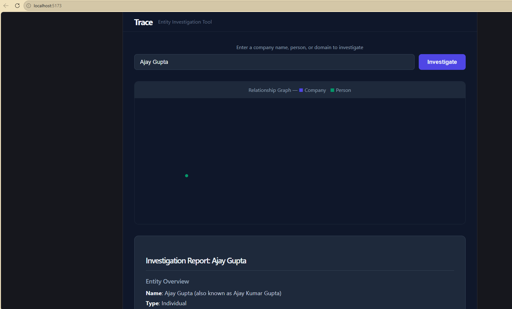

# Trace

An open-source entity investigation tool for journalists, researchers, and compliance teams.

## What it does

Enter a company name, person, or domain. Trace automatically searches across multiple public data sources, maps relationships and connections, checks sanctions exposure, and produces a structured investigation report — in seconds.



## Data sources

- **OpenSanctions** — global sanctions lists and politically exposed persons (PEPs)
- **Companies House** — UK company registry, directorships, and persons of significant control *(coming soon — pending API access)*
- **ICIJ Offshore Leaks** — Panama Papers, Pandora Papers, FinCEN Files *(planned)*
- **GDELT** — global news mentions *(planned)*
- **PACER / Find Case Law** — court records *(planned)*

## Architecture
User query
↓
React frontend
↓
FastAPI backend
↓
Agent loop (Claude claude-sonnet-4-20250514)
├── search_entities       → Postgres
├── get_relationships     → Postgres
├── get_risk_flags        → Postgres
└── search_documents      → pgvector semantic search
↓
Structured investigation report + relationship graph
**Stack:** Python · FastAPI · PostgreSQL · pgvector · React · Vite · OpenAI embeddings · Anthropic Claude

## Getting started

### Prerequisites

- Python 3.11+
- Node.js 18+
- Docker

### 1. Clone the repo
```bash
git clone https://github.com/czap-png/Trace.git
cd Trace
```

### 2. Set up Python environment
```bash
python -m venv .venv
source .venv/bin/activate  # Windows: .venv\Scripts\activate
pip install -r requirements.txt
```

### 3. Configure environment variables
```bash
cp .env.example .env
# Edit .env and add your API keys
```

You will need:
- `OPENAI_API_KEY` — for generating embeddings ([platform.openai.com](https://platform.openai.com))
- `ANTHROPIC_API_KEY` — for the investigation agent ([console.anthropic.com](https://console.anthropic.com))

### 4. Start the database
```bash
docker compose up -d
```

### 5. Run ingestion pipelines
```bash
python -m ingestion.run
```

This will ingest OpenSanctions data into your local database.

### 6. Start the API server
```bash
uvicorn api:app --reload
```

### 7. Start the frontend
```bash
cd frontend
npm install
npm run dev
```

Open [http://localhost:5173](http://localhost:5173) and start investigating.

## Project structure
trace/
├── agent/
│   ├── investigator.py   # Agent loop — Claude decides what to query
│   └── tools.py          # Tool definitions and implementations
├── db/
│   ├── client.py         # Postgres connection
│   ├── embeddings.py     # Chunking, embedding, vector search
│   └── schema.sql        # Database schema
├── ingestion/
│   ├── base.py           # Abstract pipeline class
│   ├── companies_house.py
│   ├── open_sanctions.py
│   └── run.py
├── frontend/             # React + Vite
├── api.py                # FastAPI server
└── docker-compose.yml

## Roadmap

- [x] OpenSanctions ingestion pipeline
- [x] pgvector semantic search
- [x] Claude-powered investigation agent
- [x] React frontend with relationship graph
- [ ] Companies House live API integration
- [ ] ICIJ Offshore Leaks pipeline
- [ ] GDELT news pipeline
- [ ] Court records integration
- [ ] Export investigation reports as PDF
- [ ] Public deployment

## Licence

MIT
